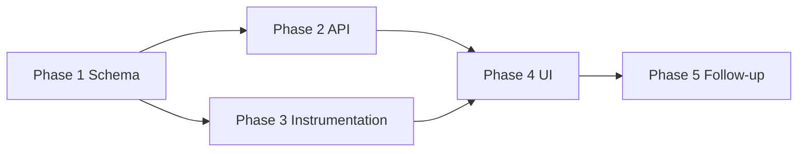

# Job Monitoring — Implementation Plan

**Status:** Planned · **Updated:** 2026-07-21 · **PR 1 (schema):** done — `V26__add_job_monitoring.sql`

Developer implementation plan for [VW-02 Job Monitoring View](job-runs-and-activity-log.md). Ordered by dependency; each phase should be shippable and testable on its own where noted.

---

## Current state

| Capability | Status | Location |
|------------|--------|----------|
| Job run persistence | Exists | `csa.job_runs` · Prisma `JobRun` |
| Job list API (paginated) | Partial | `GET /jobs` — no latest-per-type, no date filter |
| Job detail + warning | Exists | `GET /jobs/:id` · `job-openshift-advisory.ts` |
| Trigger type | Partial | `job_trigger`: `CRON` / `SYSTEM` / `END_USER` — no user IDIR stored |
| Summary metadata | Partial | `job_runs.metadata` JSON — not formatted for UI |
| Activity persistence | **Missing** | Warnings/errors go to Winston stdout only (ADR 0012) |
| Monitoring UI | **Missing** | No Monitoring tab in frontend |
| User IDIR on job create | **Missing** | JWT username available in `CSAGuard` but not passed to `createJob()` |

---

## Phase 1 — Schema and job-run enhancements

**Goal:** Database and model support for FDD fields, including who triggered user-initiated jobs.

### 1.1 Flyway migration

Add to `job_runs`:

```sql
ALTER TABLE csa.job_runs
  ADD COLUMN triggered_by_user TEXT NULL;
```

- Populate `triggered_by_user` when `job_trigger = 'END_USER'` (IDIR from JWT).
- Leave `NULL` for `CRON` and `SYSTEM` (display as **SYSTEM** in UI).

Create `job_activities` table:

```sql
CREATE TABLE csa.job_activities (
  id              SERIAL PRIMARY KEY,
  job_run_id      INT NOT NULL REFERENCES csa.job_runs(id) ON DELETE CASCADE,
  recorded_at     TIMESTAMPTZ NOT NULL DEFAULT NOW(),
  severity        TEXT NOT NULL,   -- WARNING | ERROR | CRITICAL
  activity_type   TEXT NOT NULL,   -- DATA_QUALITY | JOB | CRA | WKL | ICM | BATCH
  related         TEXT NULL,       -- plain-language reference (batch #, contact id, file name)
  message         TEXT NULL        -- optional detail; see open question in FDD
);

CREATE INDEX idx_job_activities_job_run_id ON csa.job_activities(job_run_id);
CREATE INDEX idx_job_activities_recorded_at ON csa.job_activities(recorded_at DESC);
CREATE INDEX idx_job_activities_severity_type ON csa.job_activities(severity, activity_type);
```

**Note:** Include `message` column even though FDD omits it — supports plain-language text in Related or Message until BA confirms layout.

### 1.2 Prisma schema

- Add `triggeredByUser` to `JobRun`.
- Add `JobActivity` model with relation to `JobRun`.

### 1.3 Job creation — capture user IDIR

Update `JobsController` (and any other user-initiated entry points):

- Read `request.username` from `CSAGuard`.
- Pass `triggeredByUser` into `JobsService.createJob()` for `END_USER` triggers:
  - `POST /jobs/run-eligibility`
  - `POST /jobs/auto-batch`
  - `POST /jobs/send-cra-file`

### 1.4 Display-name mapping

Add a shared map (backend + frontend):

| `JobType` | FDD Job Name |
|-----------|--------------|
| `INGEST_ICM` | Data Fetch – ICM |
| `INGEST_MIS` | Data Fetch – MIS |
| `INGEST_DATA` | Data Fetch |
| `RUN_ELIGIBILITY` | Eligibility |
| `AUTO_BATCH` | Auto Batch |
| `SEND_CRA_FILE` | Send CRA File |
| `POLL_CRA_RESPONSE` | Weekly Response |
| `SYNC_ICM` | ICM Sync-Back |
| `RETRY_FAILED` | Retry Failed Jobs |
| `BACKFILL_*` | Backfill – {name} |

### 1.5 Summary formatters

Add `formatJobSummary(jobType, metadata, message)` per [Summary by job type](job-runs-and-activity-log.md#summary-by-job-type). Used by API responses and UI.

**Deliverables:** Migration, Prisma generate, unit tests for formatters and trigger mapping.

---

## Phase 2 — Monitoring API

**Goal:** Endpoints that match APL-10, APL-11, and APL-12 behaviour.

Suggested routes under `GET /jobs/monitoring/...` (or extend existing `/jobs`):

### 2.1 Job List (APL-10)

`GET /jobs/monitoring/latest`

- Returns **one row per monitored job type** (latest run by `started_at` or `id`).
- Default monitored set: ICM, MIS, Eligibility, Auto Batch, Send CRA File, Weekly Response.
- Response fields: OS-CSA-JL-01 through OS-CSA-JL-08.
- Include OpenShift warning via existing `getJobRunWarning()`.

### 2.2 Job History (APL-11)

`GET /jobs/monitoring/history`

Query params:

| Param | Default | Notes |
|-------|---------|-------|
| `since` | 30 days ago | Pacific boundary or UTC with client format |
| `page` | 1 | |
| `limit` | 10 | FDD page size |
| `jobType` | — | Optional filter |
| `status` | — | Optional filter |
| `triggerBy` | — | SYSTEM or user IDIR |

- Order: newest first (`started_at DESC`).
- Top-level jobs only (`parent_job_id IS NULL`) unless filtering by child type.
- Same response shape as Job List rows.

### 2.3 Activities (APL-12)

`GET /jobs/monitoring/activities`

Query params:

| Param | Default | Notes |
|-------|---------|-------|
| `jobRunId` | — | When set, filter to that run (Job History selection) |
| `since` | retention period | TBD — propose 90 days |
| `page` | 1 | |
| `limit` | 10 | |
| `severity` | — | Optional |
| `activityType` | — | Optional |

- Default (no `jobRunId`): recent activities across all jobs.
- Response fields: OS-CSA-JA-01 through OS-CSA-JA-04 + Job ID.

### 2.4 Trigger By in API responses

Map for UI:

```typescript
function formatTriggerBy(job: JobRun): string {
  if (job.jobTrigger === 'END_USER' && job.triggeredByUser) {
    return job.triggeredByUser.toUpperCase()
  }
  return 'SYSTEM'
}
```

**Deliverables:** Controller, service methods, OpenAPI docs, controller specs.

---

## Phase 3 — Activity instrumentation

**Goal:** Persist operator-relevant notices to `job_activities` during job execution.

### 3.1 Activity service

Create `JobActivityService`:

```typescript
recordActivity(params: {
  jobRunId: number
  severity: 'WARNING' | 'ERROR' | 'CRITICAL'
  activityType: ActivityType
  related?: string
  message?: string
}): Promise<void>
```

- Call from job handlers — do **not** replace Winston logging; write to both stdout and DB for curated events.
- Aggregate high-volume events (e.g. eligibility skips → one row: "42 contacts skipped").

### 3.2 Instrumentation targets (v1)

| Handler / service | Activity type | Severity | Notes |
|-------------------|---------------|----------|-------|
| `eligibility.service.ts` | DATA_QUALITY | CRITICAL | Skipped contacts (aggregated) |
| `poll-cra-response.handler.ts` | CRA, WKL | WARNING / ERROR | Invalid files, batch mismatches, WKL skips |
| `send-cra-file.handler.ts` | CRA, BATCH | ERROR | Transfer failures |
| `JobsController` / launcher | JOB | ERROR | OpenShift launch failure |
| `retry-failed.handler.ts` | JOB | WARNING | Stuck job reconciliation |
| ICM sync-back (multiple handlers) | ICM | WARNING | Partial sync failure summary |
| `auto-batch.service.ts` | BATCH | WARNING | Skipped contacts (aggregated) |

### 3.3 Severity mapping from Winston

| Winston level | Activity severity |
|---------------|-------------------|
| `warn` | WARNING |
| `error` | ERROR |
| `crit` | CRITICAL |
| `alert` | CRITICAL |

**Deliverables:** Service, handler updates, integration tests with mocked Prisma.

---

## Phase 4 — Frontend Monitoring tab

**Goal:** VW-02 UI for system admin users.

### 4.1 Tab and access

- Add **Monitoring** tab to `App.tsx` (visible to CSA users; role-based gating deferred until responsibility model exists).
- Keep existing header timestamps and running-job banners unchanged.

### 4.2 Components

| Component | Applet | Behaviour |
|-----------|--------|-----------|
| `JobListTable` | APL-10 | Latest run per type; column filter/sort; clear all |
| `JobHistoryTable` | APL-11 | 1-month history; pagination (10); row select/deselect |
| `ActivitiesTable` | APL-12 | Default recent activities; filtered by selected history row |

### 4.3 Interaction

- Job History row click → set `selectedJobRunId` → refetch Activities.
- Deselect → clear `selectedJobRunId` → Activities default view.
- Auto-refresh while any monitored job is **Running** (poll Job List + History).
- Pacific time formatting: `yyyy-Mmm-dd hh:mm:ss`.

### 4.4 API client

Add to `contacts-service.ts` (or new `monitoring-service.ts`):

- `getJobMonitoringLatest()`
- `getJobMonitoringHistory(params)`
- `getJobMonitoringActivities(params)`

**Deliverables:** Tab, three tables, loading/empty states, basic E2E or component tests.

---

## Phase 5 — Follow-up (optional)

Polish after Phases 1–4 ship. Not required for M3 (Monitoring tab live).

### 5.1 Logging convention and audit

**Goal:** One rule — `log`/`info` = Splunk only; tagged `warn`/`error`/`crit` on `AppLogger` = Splunk + Activities when `activityType` or `category` is set.

| Task | Status |
|------|--------|
| Document convention | Done — ADR 0012 + `AppLogger` JSDoc |
| **`AppLogger` tagged dual-write** | Done — `warn`/`error`/`crit` persist when tagged |
| **Warn/error audit** | Done — demoted mocks/config/backfill detail to `log`; integration/auth/data-quality stays `warn` in Splunk |
| **Migrate `activity*` call sites** | Done — handlers and services use tagged `warn`/`error`/`crit` |
| **Migrate to `AppLogger`** | Done where needed — batch, contacts, handlers; infra stays on Nest `Logger` |
| **Centralize batch activities** | Done — `batches.service` |
| **Align `crit()` gate** | Done — explicit tag check matches `warn`/`error` |
| **Remove deprecated wrappers** | Done — `activityWarn` / `activityError` / `activityCrit` removed |

### 5.2 Contact merge (blocked on contact-merge FDD)

| Task | Notes |
|------|-------|
| Contact merge activities | When contact-merge automation ships, log merge warnings/errors to Activities (see contact-merge.md) |

---

## Suggested delivery order



| Milestone | Phases | User-visible outcome |
|-----------|--------|----------------------|
| M1 | 1 + 2 | API returns Job List, History, Activities (activities empty until Phase 3) |
| M2 | 3 | Activities populate during job runs |
| M3 | 4 | Monitoring tab live for CSA users |
| M4 | 5 (optional) | Logging convention fully applied; contact-merge activities when that FDD ships |

---

## Testing checklist

### Backend

- [ ] Latest-per-type query returns one row per monitored job type
- [ ] History defaults to 30-day window, paginates at 10
- [ ] Activities filter by `jobRunId` matches Job History selection
- [ ] `triggeredByUser` set on user-initiated jobs; `SYSTEM` displayed otherwise
- [ ] Summary formatters produce expected strings per job type
- [ ] Warning column populated only for RUNNING jobs with OpenShift advisory
- [ ] Activity aggregation reduces high-volume skip logs to single rows

### Frontend

- [ ] Job History selection filters Activities; deselect restores default
- [ ] Column filter, sort, and clear-all work on all three tables
- [ ] Pacific timestamps match FDD format
- [ ] Running jobs trigger auto-refresh without breaking selection state

---

## Related documentation

- [Job Monitoring FDD](job-runs-and-activity-log.md)
- [ADR 0012 — Structured Logging](../docs/decisions/0012-structured-logging-design.md) — stdout logging remains; Activities is a curated UI subset
- [ADR 0004 — OpenShift CronJobs](../docs/decisions/0004-openshift-cronjobs-no-in-app-scheduler.md) — job execution model
- [Database schema wiki](../local-context/wiki/4-data-integration/4.1-database-schema.md) — update after migration lands
